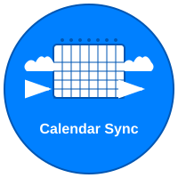

<div id="top">

<!-- HEADER STYLE: MODERN -->
<div align="left" style="position: relative; width: 100%; height: 100%; ">



# Calendar Sync

<em>Seamlessly Unify Your Google and iCloud Calendars<em>

<!-- BADGES -->


<em>Built with the tools and technologies:</em>


</div>
</div>
<br clear="right">

---

## ☀️ Table of Contents

<details>
<summary>Table of Contents</summary>

- [☀ ️ Table of Contents](#-table-of-contents)
- [🌞 Overview](#-overview)
- [🔥 Features](#-features)
- [🌅 Project Structure](#-project-structure)
    - [🌄 Project Index](#-project-index)
- [🚀 Getting Started](#-getting-started)
    - [🌟 Prerequisites](#-prerequisites)
    - [⚡ Installation](#-installation)
    - [🔆 Usage](#-usage)
    - [🌠 Testing](#-testing)
- [🌻 Roadmap](#-roadmap)
- [🤝 Contributing](#-contributing)
- [📜 License](#-license)
- [✨ Acknowledgments](#-acknowledgments)

</details>

---

## 🌞 Overview

Calendar Sync is a powerful Python application that automatically synchronizes events between Google Calendar and iCloud Calendar, ensuring your schedules stay consistent across both platforms.

**Why Calendar Sync?**

This project solves the common problem of managing multiple calendar platforms. The core features include:

- **🔄 Two-Way Synchronization:** Automatically syncs events in both directions between Google Calendar and iCloud
- **⚡ Real-Time Updates:** Keeps your calendars in sync with hourly automated runs via Google Cloud Functions
- **🔍 Dry Run Mode:** Preview changes before applying them to ensure accuracy
- **⏰ Customizable Time Windows:** Sync events from the past 90 days to future 365 days
- **🔐 Secure Authentication:** Uses OAuth2 for Google and App-Specific Passwords for iCloud
- **☁️ Cloud Deployment:** Runs automatically on Google Cloud Functions with Cloud Scheduler

---

## 🔥 Features

### 🔄 **Core Synchronization**
- **Two-Way Sync**: Automatically syncs events between Google Calendar and iCloud Calendar
- **Real-Time Updates**: Hourly automated synchronization via Google Cloud Functions
- **Bidirectional Support**: Changes made on either platform are reflected on the other

### ⚙️ **Configuration & Control**
- **Dry Run Mode**: Preview changes before applying them to ensure accuracy
- **Customizable Time Windows**: Sync events from past 90 days to future 365 days
- **Flexible Sync Direction**: Support for one-way or two-way synchronization
- **Environment-Based Configuration**: Secure credential management with .env support

### 🔐 **Security & Authentication**
- **OAuth 2.0 Integration**: Secure Google Calendar API authentication
- **App-Specific Passwords**: Secure iCloud authentication without storing main passwords
- **Cloud-Native Security**: Leverages Google Cloud's built-in security features

### ☁️ **Cloud Deployment**
- **Google Cloud Functions**: Serverless execution with automatic scaling
- **Cloud Scheduler**: Automated hourly execution without manual intervention
- **Cost-Effective**: Pay-per-execution model with minimal resource usage
- **Monitoring & Logging**: Built-in Google Cloud logging and monitoring

### 🛠️ **Technical Features**
- **CalDAV Protocol**: Native iCloud calendar integration
- **Google Calendar API**: Full access to Google Calendar features
- **Timezone Handling**: Proper timezone conversion and management
- **Error Handling**: Robust error handling and retry mechanisms
```

---

## 🌅 Project Structure

```sh
└── calendar-sync/
    ├── cloud_deploy/
    │   ├── main.py
    │   └── requirements.txt
    ├── cloud_deploy.sh
    ├── sync_calendars.py
    ├── .env-example
    ├── client_secret_*.json
    ├── token.json
    └── logo.svg
```

### 🌄 Project Index

<details open>
	<summary><b><code>CALENDAR-SYNC.GIT/</code></b></summary>
	<!-- __root__ Submodule -->
	<details>
		<summary><b>__root__</b></summary>
		<blockquote>
			<div class='directory-path' style='padding: 8px 0; color: #666;'>
				<code><b>⦿ __root__</b></code>
			<table style='width: 100%; border-collapse: collapse;'>
			<thead>
				<tr style='background-color: #f8f9fa;'>
					<th style='width: 30%; text-align: left; padding: 8px;'>File Name</th>
					<th style='text-align: left; padding: 8px;'>Summary</th>
				</tr>
			</thead>
				<tr style='border-bottom: 1px solid #eee;'>
					<td style='padding: 8px;'><b><a href='https://github.com/a-laz/calendar-sync.git/blob/master/sync_calendars.py'>sync_calendars.py</a></b></td>
					<td style='padding: 8px;'>- The <code>sync_calendars.py</code> file serves as a critical component of a calendar synchronization tool, which bridges Google Calendar and iCloud services<br>- Its primary purpose is to ensure that calendar events are accurately mirrored between these two platforms, facilitating seamless integration and consistent data across user devices<br>- By leveraging environment configurations, it offers flexible synchronization options, including the direction of sync (e.g., one-way or two-way) and the time window for past and future events<br>- This file plays a pivotal role in maintaining up-to-date and synchronized calendar data, contributing to the projects overall goal of enhancing personal productivity through efficient calendar management.</td>
				</tr>
				<tr style='border-bottom: 1px solid #eee;'>
					<td style='padding: 8px;'><b><a href='https://github.com/a-laz/calendar-sync.git/blob/master/cloud_deploy.sh'>cloud_deploy.sh</a></b></td>
					<td style='padding: 8px;'>- Deploys a Google Cloud Function named calendar-sync within the firm-braid-475420-p9 project to synchronize calendar data<br>- Utilizes Python runtime and sets environment variables for configuration, facilitating two-way synchronization with specified Google and iCloud accounts<br>- Establishes a Cloud Scheduler job to automatically trigger the function every hour, ensuring continuous data synchronization and enabling log access for monitoring deployment and execution status.</td>
				</tr>
			</table>
		</blockquote>
	</details>
	<!-- cloud_deploy Submodule -->
	<details>
		<summary><b>cloud_deploy</b></summary>
		<blockquote>
			<div class='directory-path' style='padding: 8px 0; color: #666;'>
				<code><b>⦿ cloud_deploy</b></code>
			<table style='width: 100%; border-collapse: collapse;'>
			<thead>
				<tr style='background-color: #f8f9fa;'>
					<th style='width: 30%; text-align: left; padding: 8px;'>File Name</th>
					<th style='text-align: left; padding: 8px;'>Summary</th>
				</tr>
			</thead>
				<tr style='border-bottom: 1px solid #eee;'>
					<td style='padding: 8px;'><b><a href='https://github.com/a-laz/calendar-sync.git/blob/master/cloud_deploy/requirements.txt'>requirements.txt</a></b></td>
					<td style='padding: 8px;'>- Define the necessary Python package dependencies for the cloud deployment component of the project<br>- By specifying required versions of libraries related to Google APIs, authentication, calendar data handling, and timezone management, it ensures compatibility and stability within the cloud environment<br>- This setup facilitates seamless integration with Google services and efficient management of calendar events, contributing to the overall functionality of the project.</td>
				</tr>
				<tr style='border-bottom: 1px solid #eee;'>
					<td style='padding: 8px;'><b><a href='https://github.com/a-laz/calendar-sync.git/blob/master/cloud_deploy/main.py'>main.py</a></b></td>
					<td style='padding: 8px;'>- The <code>cloud_deploy/main.py</code> file serves as the central component for synchronizing calendar data between Google Calendar and iCloud<br>- This script is designed to facilitate seamless communication and synchronization of calendar events across these platforms, ensuring that users have consistent and up-to-date scheduling information regardless of the service they are using<br>- It is configurable to run in a two-way or one-way synchronization mode and includes customizable time windows for past and future events<br>- The script leverages Google Calendar API and CalDAV protocol for iCloud integration, making it a versatile solution for users needing cross-platform calendar synchronization.</td>
				</tr>
			</table>
		</blockquote>
	</details>
</details>

---

## 🚀 Getting Started

### 🌟 Prerequisites

This project requires the following dependencies:

- **Programming Language:** Python
- **Package Manager:** Pip

### ⚡ Installation

#### Quick Setup
```sh
# Clone the repository
git clone https://github.com/user/calendar.git
cd calendar

# Set up environment
cp .env-example .env
# Edit .env with your credentials

# Install dependencies
pip install -r cloud_deploy/requirements.txt
```

#### Prerequisites
- **Google Account**: With Calendar API enabled
- **iCloud Account**: With App-Specific Password generated
- **Python 3.7+**: For local development
- **Google Cloud Account**: For cloud deployment

#### Environment Variables
Copy `.env-example` to `.env` and configure:

```bash
# Google Calendar
GOOGLE_CALENDAR_ID=primary

# iCloud Calendar (use App-Specific Password)
ICLOUD_USERNAME=your_email@icloud.com
ICLOUD_PASSWORD=your_app_specific_password

# Sync Configuration
SYNC_DIRECTION=two_way
DRY_RUN=false
WINDOW_PAST_DAYS=90
WINDOW_FUTURE_DAYS=365
```

### 🔆 Usage

#### Local Development
```sh
# Set up environment variables
cp .env-example .env
# Edit .env with your credentials

# Run the sync locally
python sync_calendars.py
```

#### Cloud Deployment

##### Prerequisites for Cloud Deployment

1. **Google Cloud Project Setup**
   - Create a Google Cloud Project
   - Enable the following APIs:
     - Google Calendar API
     - Cloud Functions API
     - Cloud Scheduler API
   - Set up billing for your project

2. **Google Calendar API Credentials**
   
   **Option A: OAuth2 Client (Recommended for personal use)**
   ```sh
   # 1. Go to Google Cloud Console > APIs & Services > Credentials
   # 2. Click "Create Credentials" > "OAuth client ID"
   # 3. Choose "Desktop application"
   # 4. Download the JSON file and rename it to:
   #    client_secret_<your-client-id>.apps.googleusercontent.com.json
   # 5. Place it in your project root directory
   ```

   **Option B: Service Account (For automated deployment)**
   ```sh
   # 1. Go to Google Cloud Console > APIs & Services > Credentials
   # 2. Click "Create Credentials" > "Service account"
   # 3. Create a service account and download the JSON key
   # 4. Rename it to: service-account-key.json
   # 5. Place it in your project root directory
   # 6. Share your Google Calendar with the service account email
   ```

3. **iCloud App-Specific Password**
   ```sh
   # 1. Go to https://appleid.apple.com/account/manage
   # 2. Sign in with your Apple ID
   # 3. Go to "Security" section
   # 4. Click "Generate Password" under "App-Specific Passwords"
   # 5. Enter a label like "Calendar Sync"
   # 6. Copy the generated password (format: xxxx-xxxx-xxxx-xxxx)
   ```

##### Deploy to Google Cloud Functions

**⚠️ Important: Update `cloud_deploy.sh` before deploying**

The current `cloud_deploy.sh` contains hardcoded values that need to be updated:

```sh
# Current values in cloud_deploy.sh (UPDATE THESE):
PROJECT_ID="firm-braid-475420-p9"  # ← Change to your project ID
ICLOUD_USERNAME=XXXXX  # ← Change to your iCloud email
ICLOUD_PASSWORD=XXXXX  # ← Change to your app-specific password
```

**Required Updates:**

1. **Update Project ID**
   ```sh
   # Line 3 in cloud_deploy.sh
   PROJECT_ID="your-google-cloud-project-id"
   ```

2. **Update iCloud Credentials**
   ```sh
   # Line 20 in cloud_deploy.sh - update the --set-env-vars section:
   --set-env-vars GOOGLE_CALENDAR_ID=primary,ICLOUD_USERNAME=your_email@icloud.com,ICLOUD_PASSWORD=your_app_specific_password,SYNC_DIRECTION=two_way,DRY_RUN=false,WINDOW_PAST_DAYS=90,WINDOW_FUTURE_DAYS=365
   ```

3. **Optional: Update Function Name and Region**
   ```sh
   # Lines 4-5 in cloud_deploy.sh
   FUNCTION_NAME="calendar-sync"  # Keep or change as needed
   REGION="us-central1"           # Choose your preferred region
   ```

**Deploy the function:**
```sh
# Make sure you're authenticated with Google Cloud
gcloud auth login
gcloud config set project YOUR_PROJECT_ID

# Deploy to Google Cloud Functions
./cloud_deploy.sh

# The function will run automatically every hour
# Check logs with:
gcloud functions logs read calendar-sync --region us-central1
```

##### Post-Deployment Verification

```sh
# Test the function manually
gcloud functions call calendar-sync --region us-central1

# Check function status
gcloud functions describe calendar-sync --region us-central1

# View recent logs
gcloud functions logs read calendar-sync --region us-central1 --limit 50

# Check scheduler job
gcloud scheduler jobs list --location us-central1
```

### 🌠 Testing

Test the sync functionality:

```sh
# Test with dry run mode
export DRY_RUN=true
python sync_calendars.py

# Test specific time window
export WINDOW_PAST_DAYS=7
export WINDOW_FUTURE_DAYS=30
python sync_calendars.py
```

---

## 🌻 Roadmap

- [X] **Two-way Calendar Sync**: ✅ Implemented bidirectional synchronization between Google Calendar and iCloud
- [X] **Cloud Deployment**: ✅ Deployed to Google Cloud Functions with automated scheduling
- [X] **Environment Configuration**: ✅ Added secure credential management with .env support
- [ ] **Event Conflict Resolution**: Handle conflicts when events are modified on both platforms
- [ ] **Recurring Event Support**: Enhanced support for complex recurring event patterns
- [ ] **Web Dashboard**: Create a web interface for monitoring sync status and managing settings
- [ ] **Mobile App**: Develop a mobile app for on-the-go calendar management

---

## 🤝 Contributing

- **💬 [Join the Discussions](https://github.com/user/calendar/discussions)**: Share your insights, provide feedback, or ask questions.
- **🐛 [Report Issues](https://github.com/user/calendar/issues)**: Submit bugs found or log feature requests for the calendar project.
- **💡 [Submit Pull Requests](https://github.com/user/calendar/blob/main/CONTRIBUTING.md)**: Review open PRs, and submit your own PRs.

<details closed>
<summary>Contributing Guidelines</summary>

1. **Fork the Repository**: Start by forking the project repository to your github account.
2. **Clone Locally**: Clone the forked repository to your local machine using a git client.
   ```sh
   git clone https://github.com/user/calendar.git
   ```
3. **Create a New Branch**: Always work on a new branch, giving it a descriptive name.
   ```sh
   git checkout -b new-feature-x
   ```
4. **Make Your Changes**: Develop and test your changes locally.
5. **Commit Your Changes**: Commit with a clear message describing your updates.
   ```sh
   git commit -m 'Implemented new feature x.'
   ```
6. **Push to github**: Push the changes to your forked repository.
   ```sh
   git push origin new-feature-x
   ```
7. **Submit a Pull Request**: Create a PR against the original project repository. Clearly describe the changes and their motivations.
8. **Review**: Once your PR is reviewed and approved, it will be merged into the main branch. Congratulations on your contribution!
</details>

<details closed>
<summary>Contributor Graph</summary>
<br>
<p align="left">
   <a href="https://github.com/user/calendar/graphs/contributors">
      
   </a>
</p>
</details>

---

## 📜 License

This project is licensed under the MIT License. For more details, refer to the [LICENSE](LICENSE) file.

---

## ✨ Acknowledgments

- **Google Calendar API** - For providing robust calendar integration capabilities
- **iCloud CalDAV** - For enabling seamless iCloud calendar synchronization
- **Google Cloud Functions** - For serverless execution and automated scheduling
- **Python Community** - For the excellent libraries that make this project possible
- **Open Source Contributors** - For the various open source tools and libraries used in this project

<div align="right">

[![][back-to-top]](#top)

</div>


[back-to-top]: https://img.shields.io/badge/-BACK_TO_TOP-151515?style=flat-square


---
